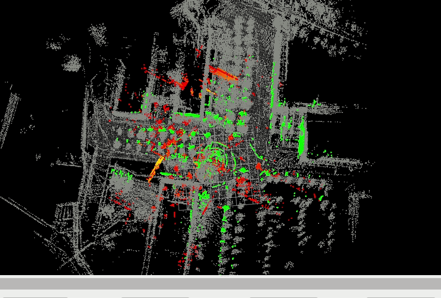
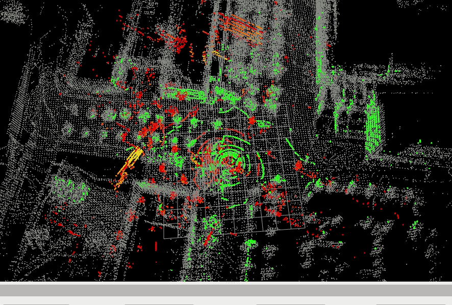

# fast-lio2-map-based-localization
map-based localization.Modified from [fast-lio2](https://github.com/hku-mars/FAST_LIO) and [s-fast-lio](https://github.com/zlwang7/S-FAST_LIO)


# 1.Prerequisites
just to follow [s-fast-lio](https://github.com/zlwang7/S-FAST_LIO),I won't go into further detail here.

# 2.Build 
```
cd ~/catkin_ws/src
git clone https://github.com/xz00/fast-lio2-map-based-localization.git
cd ../
catkin_make
source ~/catkin_ws/devel/setup.bash
```

# 3.Relocalization
## 3.1 build a global map
Recommend [fast-lio-sam](https://github.com/kahowang/FAST_LIO_SAM/tree/master) to build a global map.This work utilizes loop detection and point cloud matching, and updates the optimized pose to the front-end, enabling the creation of a high-quality map in a wide range of scenes. Can be used to create global maps based on map localization.
a large global map example:


## 3.2 modify the path of the global map
Files that need to be modified is **config/velodyne_re.yaml**

edit this param: globalmap_dir: "/home/xz/Desktop/catkin_fastlio_slam/data/totalmap.pcd"  # starts and ends with "/". 

## 3.3 run the launch and bag
```
roslaunch sfast_lio mapping_velodyne_relocalization.launch
rosbag play your-bag.bag
```

## 3.3 initialization
### 3.3.1 rough initialization
The rough initialization method is the same as [LIO-SAM_based_relocalization](https://github.com/Gaochao-hit/LIO-SAM_based_relocalization),complete initialization matching of point clouds by specifying an initialization position and direction in rviz.

### 3.3.2 accurate initialization
Sometimes rough initialization method may not be successful, so it is necessary to use accurate initialization method to do NDT Registration with a better initial value. 

In order to provide a better matching initial value, I used a Python script to obtain keyboard input and continuously adjusted this matching initial value, ultimately successfully initializing it in the map. Providing accurate initial values can significantly increase the success rate of initialization.

Open a new terminal in the working directory and execute the following statement：
```
source devel/setup.bash
rosrun sfast_lio keyboard_catch_local.py
```

And then in this terminal you can press the corresponding button to adjust the matching initial value:（Here, I have only defined three degrees of freedom: x, y, and yaw. This applies to most initialization situations. If you feel it's not enough, I believe readers can easily make improvements according to the code）
| keyboard input | meaning |
| :--: | :--: |
| w | Moving forward |
| s | Moving backward |
| a | Moving left |
| d | Moving right |
| q | rotate left |
| e | rotate right |
| j | increase rototation resolution |
| w | reduce rototation resolution |
| i | increase distance resolution |
| k | reduce distance resolution |
| f | finish, start register |

When you think the matching initial value you adjusted is good enough, you can press “f“ to do NDT Registration.
<br><br/>

</img>&nbsp;&nbsp;&nbsp;&nbsp;&nbsp;&nbsp;&nbsp;&nbsp;
</img>

&nbsp;&nbsp;&nbsp;&nbsp;&nbsp;&nbsp;&nbsp;&nbsp;&nbsp;&nbsp;&nbsp;&nbsp;**adjust the matching initial value**&nbsp;&nbsp;&nbsp;&nbsp;&nbsp;&nbsp;&nbsp;&nbsp;&nbsp;&nbsp;&nbsp;&nbsp;&nbsp;&nbsp;&nbsp;&nbsp;&nbsp;&nbsp;&nbsp;&nbsp;&nbsp;&nbsp;&nbsp;&nbsp;&nbsp;&nbsp;&nbsp;&nbsp;&nbsp;&nbsp;&nbsp;&nbsp;&nbsp;&nbsp;&nbsp;&nbsp;&nbsp;&nbsp;&nbsp;&nbsp;&nbsp;&nbsp;&nbsp;**initialization successful**

The green pointcloud is the pointcloud you are adjusting. The red pointcloud is the matched pointcloud after NDT Registration. The yellow pointcloud is the local map.

## 3.4 start to relocalization
**<font color="red">note:this code can provide two kind of odometry.</font>**
> 1. "/Odometry_relocal",**this is just local scan register to local map**,so when IMU is not very stable and may drift,this odometry may stable.
> 2. "/Odometry",this is the result of loose coupling between IMU recursive results and point cloud matching results.

# 4.The principle of relocalization algorithm
The principle is very easy.After the pose is initialized, based on the forward propagation of IMU, when the point cloud is generated, it is registered with the local map, and the results of IMU and point cloud registration are updated through Bayesian rule. You can change some local map's params in the config/velodyne_re.yaml.

# 5.to do
5.1 upload the pcd and bag for reader to run an example. 

**here is an example link [example PCD and bag](https://pan.baidu.com/s/1No9ZvqtsM8LAxMmpLzKf0Q?pwd=nb73)**

5.2 record a video to show this code how to use.

**here is a video to show [example](https://www.bilibili.com/video/BV1pM4m197zN/?spm_id_from=333.999.0.0&vd_source=2cbf4364275a2c6c4db080c149572d49)**

# 6.Acknowledgements
[fast-lio2](https://github.com/hku-mars/FAST_LIO) 

[s-fast-lio](https://github.com/zlwang7/S-FAST_LIO)

[fast-lio-sam](https://github.com/kahowang/FAST_LIO_SAM/tree/master)

[LIO-SAM_based_relocalization](https://github.com/Gaochao-hit/LIO-SAM_based_relocalization)
